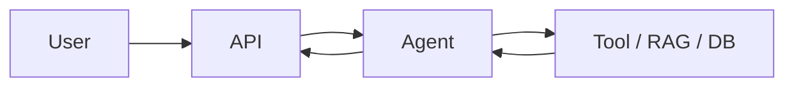

# CASE_STUDY — <название проекта>

> Универсальный шаблон портфельного описания одного проекта. Копируется в `projects/<NN>-<name>/CASE_STUDY.md` и заполняется к концу соответствующего модуля. Это то, что ты предъявляешь работодателю / клиенту — короткий, на цифрах, без лозунгов.

## 1. Problem

Какую конкретную проблему решает проект и для кого. Одна-две фразы, не «AI меняет мир». Опирайся на свой [`positioning.md`](./positioning.md) — Target domain + Workflow wedge.

```
<здесь>
```

## 2. Why LLM / agent here

Почему именно LLM/agent-решение, а не классический pipeline. Если можно было решить regex’ом и SQL — так и пиши, и тогда заверши case-study выводом «LLM здесь не нужен».

```
<здесь>
```

## 3. Architecture

Текстом + Mermaid-диаграмма. Минимум:

- Какие компоненты (API, agent, RAG, tools, БД).
- Где границы.
- Поток одного типового запроса.



## 4. Tools & models

- LLM models (роль → конкретный `model_id` + `last_verified`).
- Embeddings (если RAG).
- Vector DB / основные хранилища.
- Внешние API / интеграции.
- Фреймворки (LangGraph и т.д.) с обоснованием выбора.

## 5. Failure modes

Что ломается / могло сломаться. По каждой строке — как ловим (eval-кейс, guardrail, алерт):

- Hallucination on Q-type X → forced citations, faithfulness ≥ 0.9, refusal eval.
- Tool 5xx / 429 → retry policy, classification, fallback.
- Prompt injection в источнике → fencing, output filter, allow-list.
- Cost runaway → per-session budget, alert.
- LLM provider down → fallback / `degraded` flag. **В M01 этого слоя нет** (M01 работает на FakeLLMClient без реальных провайдеров); заполняется начиная с M02. В M01-case-study оставь `N/A — M01 baseline`.
- ...

## 6. Guardrails

Активные защитные слои:

- Input filter: ...
- Output filter: ...
- Approval gates: ...
- ACL / permission boundaries: ...
- PII masking: ...

## 7. Observability fields

Какие поля летят в логи / трассы каждого запроса:

- `request_id`, `session_id`, `user_id`, `tenant_id`.
- `model_used`, `prompt_version`, `schema_version`.
- `tokens_in`, `tokens_out`, `cost_usd`.
- `latency_ms`, `n_tool_calls`.
- `cache_hit`, `degraded`.
- `judge_score` (если online evals).

## 8. Metrics & evaluation

Главное в одном экране. Eval-set, по которому считалось — отдельный артефакт.

| Метрика | Baseline | Achieved | Eval-set | Дата |
|---------|----------|----------|----------|------|
|         |          |          |          |      |
|         |          |          |          |      |
|         |          |          |          |      |

Плюс короткий dev-журнал (1–3 итерации):

- v1.0.0 — baseline: <key numbers>.
- v1.1.0 — изменил <prompt/retriever/router>: <delta>.
- v1.2.0 — ...

## 9. Tradeoffs

Конкретные компромиссы, которые ты сознательно сделал:

- Выбрал hybrid retrieval, отказался от reranker’а — снизил latency на 800ms ценой -3% recall@5.
- Не сделал sentence-level compression — экономия времени, плюс 12% tokens к среднему запросу.
- Reviewer-loop отключён в продакшене — оставлен только в eval-режиме (дорогой).

## 10. Where the stub is replaced

Если в проекте есть учебная заглушка (например, `FakeLLMClient` в M01) — явно укажи **где** и **на что** она меняется в более поздних модулях. Это снимает у читателя вопрос «а это вообще production-ready или demo».

## 11. Demo

- 1–3 мин screencast (Loom / YouTube). Прямая ссылка.
- 1–2 скриншота с самой интересной сессии.

## 12. Run locally

Минимальная последовательность, чтобы запустить:

```bash
git clone ...
cp .env.example .env
make dev && make up
make test
make smoke   # если есть
```

## 13. Roadmap / lessons learned

Что бы сделал по-другому, что не доделал, что бы добавил с ещё неделей.

```
<здесь>
```
